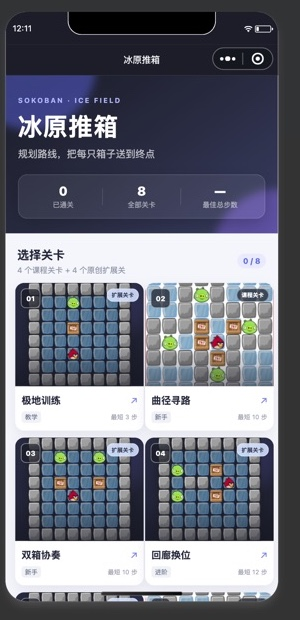
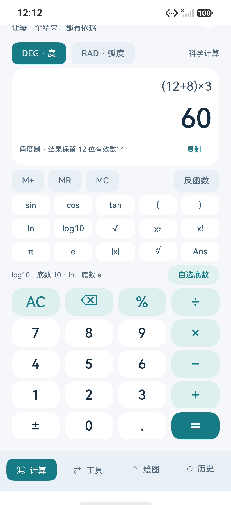
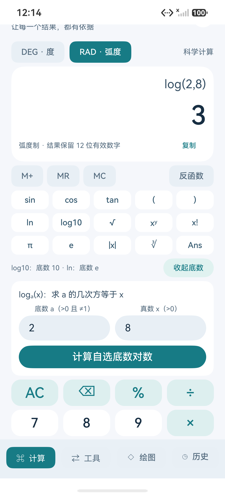
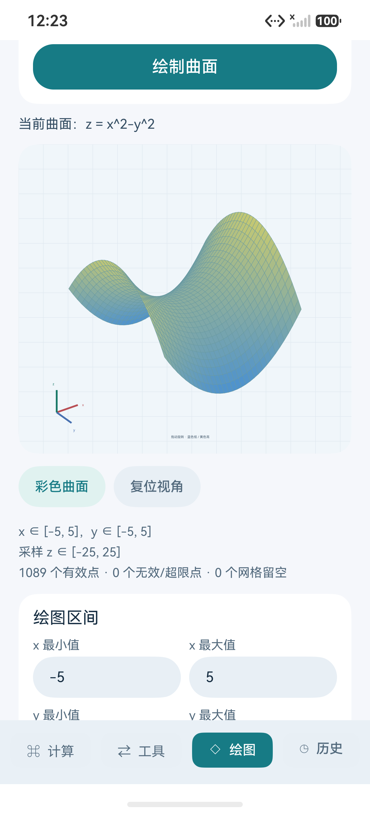

# 中国海洋大学 2026 夏《移动软件开发》

微信小程序与鸿蒙原生应用课程实验源码。

## 实验五：星算 Orbit 科学计算器

原生鸿蒙科学计算器，采用浅色界面，提供科学运算、7 类单位换算、方程求解、统计、本机历史和输入函数生成三维曲面。源码、构建方式与使用说明见 [实验五项目](lab05-harmonyos-calculator/)。

已完成 249 项算法与模式逻辑检查，以及 API 26 ARM 模拟器上的编译、安装和启动；实际界面操作的验收范围见 [验证说明](lab05-harmonyos-calculator/docs/VALIDATION.md)。

## 项目

- [实验一：第一个微信小程序](lab01-hello-miniprogram/)
- [实验二：名片小程序](lab02-business-card-miniprogram/)
- [实验三：高校新闻网](lab03-campus-news-miniprogram/)
- [实验四：推箱子游戏](lab04-sokoban-miniprogram/)
- [实验五：星算 Orbit 鸿蒙科学计算器](lab05-harmonyos-calculator/)

实验一至四是独立微信小程序，使用微信开发者工具导入。实验五是鸿蒙原生工程，使用 DevEco Studio，构建方式见其使用说明。

## 实验效果

### 实验一：第一个微信小程序

点击按钮后，页面文字和人物图片会在 girl 与 boy 两种状态之间同步切换。

<table>
  <tr>
    <td align="center"> girl 状态</td>
    <td align="center"> boy 状态</td>
  </tr>
</table>

### 实验二：名片小程序

使用卡片布局展示个人信息，并通过微信原生分享面板完成名片分享。

<table>
  <tr>
    <td align="center"> 名片页面</td>
    <td align="center"> 分享预览</td>
  </tr>
</table>

### 实验三：高校新闻网

在首页和新闻详情页的基础上，增加了搜索、分类筛选、沉浸式新闻流、滑动点赞收藏和互动足迹。

<table>
  <tr>
    <td align="center"> 首页</td>
    <td align="center"> 沉浸式互动</td>
    <td align="center"> 新闻详情</td>
  </tr>
</table>

### 实验四：推箱子游戏

完成 8 个推箱子关卡，支持方向按钮与四向滑动，并加入了撤销、BFS 解题提示、自动演示、通关评分和本地最佳纪录。

<table>
  <tr>
    <td align="center"> 关卡选择</td>
    <td align="center"> 自动通关入口</td>
    <td align="center"> 100 分、S 级通关</td>
  </tr>
</table>

### 实验五：星算 Orbit 鸿蒙科学计算器

使用浅色界面实现科学计算、单位换算、方程与统计，并支持输入函数生成可旋转的三维曲面。

<table>
  <tr>
    <td align="center"> 科学计算：括号与四则运算</td>
    <td align="center"> 自选底数：log₂(8) = 3</td>
    <td align="center"> 输入 x²−y² 生成马鞍面</td>
  </tr>
</table>

[查看实验五全部 11 张截图、功能与运行说明](lab05-harmonyos-calculator/#运行效果) · [CSDN 实验文章](https://blog.csdn.net/2401_87150440/article/details/164508610)
