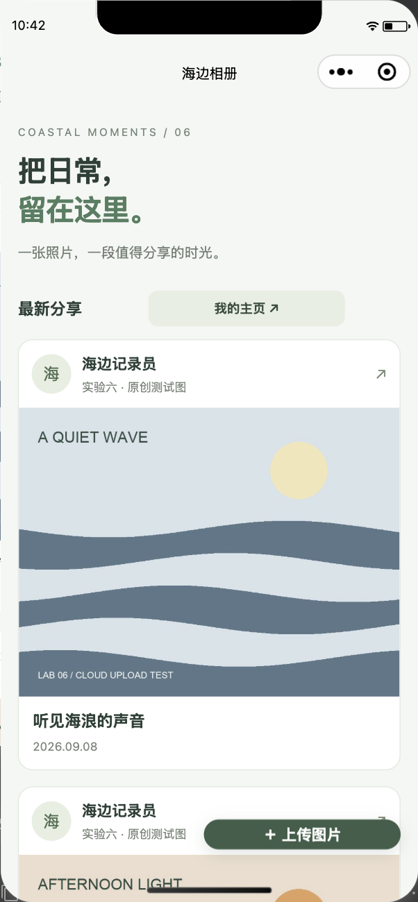

# 中国海洋大学 2026 夏《移动软件开发》

## 实验目录

- [实验一：第一个微信小程序](lab01-hello-miniprogram/)
- [实验二：名片小程序](lab02-business-card-miniprogram/)
- [实验三：高校新闻网](lab03-campus-news-miniprogram/)
- [实验四：推箱子游戏](lab04-sokoban-miniprogram/)
- [实验五：星算 Orbit 鸿蒙科学计算器](lab05-harmonyos-calculator/)
- [实验六：海边相册图片分享社区](lab06-cloud-photo-miniprogram/)

实验一至四、实验六是独立微信小程序，使用微信开发者工具导入。实验六已完成真实云环境配置和模拟器联调，更换账号时按其使用说明替换云配置。实验五是鸿蒙原生工程，使用 DevEco Studio，构建方式见其使用说明。

## 实验效果

### 实验一：第一个微信小程序

点击按钮后，页面文字和人物图片会在 girl 与 boy 两种状态之间同步切换。

<table>
  <tr>
    <td align="center"> girl 状态</td>
    <td align="center"> boy 状态</td>
  </tr>
</table>

### 实验二：名片小程序

使用卡片布局展示个人信息，并通过微信原生分享面板完成名片分享。

<table>
  <tr>
    <td align="center"> 名片页面</td>
    <td align="center"> 分享预览</td>
  </tr>
</table>

### 实验三：高校新闻网

在首页和新闻详情页的基础上，增加了搜索、分类筛选、沉浸式新闻流、滑动点赞收藏和互动足迹。

<table>
  <tr>
    <td align="center"> 首页</td>
    <td align="center"> 沉浸式互动</td>
    <td align="center"> 新闻详情</td>
  </tr>
</table>

### 实验四：推箱子游戏

完成 8 个推箱子关卡，支持方向按钮与四向滑动，并加入了撤销、BFS 解题提示、自动演示、通关评分和本地最佳纪录。

<table>
  <tr>
    <td align="center"> 关卡选择</td>
    <td align="center"> 自动通关入口</td>
    <td align="center"> 100 分、S 级通关</td>
  </tr>
</table>

### 实验五：星算 Orbit 鸿蒙科学计算器

使用浅色界面实现科学计算、单位换算、方程与统计，并支持输入函数生成可旋转的三维曲面。

<table>
  <tr>
    <td align="center"> 科学计算：括号与四则运算</td>
    <td align="center"> 自选底数：log₂(8) = 3</td>
    <td align="center"> 输入 x²−y² 生成马鞍面</td>
  </tr>
</table>

### 实验六：海边相册图片分享社区

使用微信云开发实现照片发布、个人相册、预览、下载和分享，并加入可选择模型的 AI 照片点评与本人作品删除功能。

<table>
  <tr>
    <td align="center"> 社区首页</td>
    <td align="center"> AI 模型设置</td>
    <td align="center"> 照片点评与删除</td>
  </tr>
</table>
