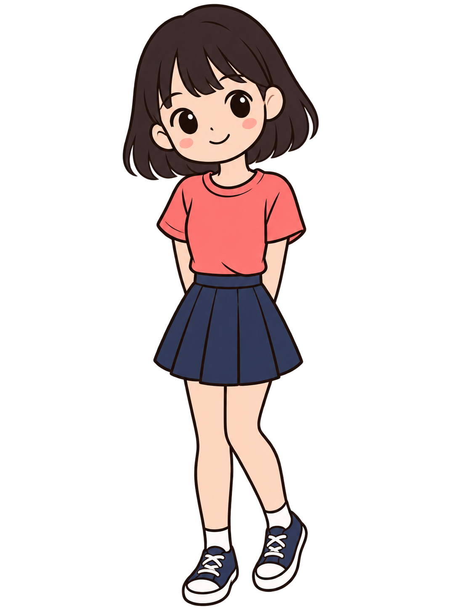

# 中国海洋大学 2026 夏《移动软件开发》

本仓库用于记录《移动软件开发》课程实验的代码与说明。当前内容为实验一：第一个微信小程序。

## 实验一：第一个微信小程序

### 实验目标

- 熟悉微信开发者工具创建、导入和调试小程序的基本流程；
- 理解 WXML、WXSS 和 JavaScript 分别负责页面结构、视觉样式与交互逻辑；
- 完成一个能够响应点击操作的 Hello World 小程序。

这个实验的重点并不只是“显示一段文字”，而是理解小程序页面三部分如何配合：WXML 放页面内容，WXSS 调整页面外观，JavaScript 管理数据并响应用户点击。

### 功能说明

页面初始显示 `hello girl!` 和女孩图片。点击“点击切换状态”按钮后，文字和图片会同步切换为 `hello boy!` 与男孩图片；再次点击则恢复初始状态。

| 当前状态 | 标题文字 | 人物资源 | 下一次点击后 |
| --- | --- | --- |
| 初始状态 | `hello girl!` | `image/girl.png` | 切换到 boy |
| 切换状态 | `hello boy!` | `image/boy.png` | 切换回 girl |

这保证了文字和图片始终成对变化，不会出现只变文字或只变图片的情况。

### 页面组成

首页采用由上到下的简单布局：导航栏、问候标题、说明文字、人物图片和切换按钮。

```text
Hello World 导航栏
        ↓
hello girl! / hello boy!
        ↓
这是我的第一个微信小程序
        ↓
女孩图 / 男孩图
        ↓
点击切换状态
```

下面是页面使用的两张人物图片。

| girl 状态资源 | boy 状态资源 |
| --- | --- |
|  |  |

### 实现要点

- `pages/index/index.wxml` 使用 `{{wording}}` 和 `{{imageSrc}}` 绑定页面数据，并通过 `bindtap="onClick"` 处理按钮点击；
- `pages/index/index.js` 在 `data` 中维护文字和图片路径，使用 `this.setData()` 同步更新两个状态；
- `pages/index/index.wxss` 设置居中布局、标题、图片尺寸和按钮样式，图片通过 `aspectFit` 完整显示。

#### 页面结构：WXML

```xml
<view class="title">hello {{wording}}!</view>
<image class="person-image" src="{{imageSrc}}" mode="aspectFit"></image>
<button class="change-button" bindtap="onClick">点击切换状态</button>
```

- `{{wording}}` 决定标题中显示 `girl` 还是 `boy`；
- `{{imageSrc}}` 决定当前展示的图片；
- `mode="aspectFit"` 能完整保留人物图片比例，避免拉伸；
- `bindtap="onClick"` 表示按钮点击后调用页面脚本中的 `onClick` 方法。

#### 交互逻辑：JavaScript

```js
onClick() {
  const isGirl = this.data.wording === 'girl'

  this.setData({
    wording: isGirl ? 'boy' : 'girl',
    imageSrc: isGirl
      ? '../../image/boy.png'
      : '../../image/girl.png'
  })
}
```

`setData()` 是小程序更新页面数据的标准方式。这里使用同一个 `isGirl` 判断同时控制标题和图片，因此两项内容会同步更新。

#### 页面样式：WXSS

```css
.person-image {
  display: block;
  width: 280rpx;
  height: 360rpx;
  margin: 56rpx auto 0;
}

.change-button {
  margin-top: 96rpx;
  color: #fff;
  background: #07c160;
}
```

页面使用居中、由上至下的布局。人物图片区通过固定展示框配合 `aspectFit` 完整显示图片，按钮使用微信常见的绿色，以突出可点击的交互入口。

### 交互逻辑

```text
首次打开页面
    ↓
data: wording = girl，imageSrc = girl 图片
    ↓ 点击按钮
data: wording = boy，imageSrc = boy 图片
    ↓ 再次点击按钮
恢复为 girl 状态
```

页面并不直接查找或修改某个标签，而是先更新 `data` 中的状态；WXML 中引用这些数据的位置会自动刷新。这是小程序中“数据驱动界面”的基本做法。

### 运行效果

页面打开后会显示女孩状态。点击底部按钮，标题和人物图片会同时切换到男孩状态；再次点击即可切换回来。图片使用 `aspectFit` 显示，因此人物比例不会被拉伸。

### 项目结构

```text
pages/index/
├── index.wxml   # 页面结构与数据绑定
├── index.wxss   # 页面样式
├── index.js     # 页面数据与点击事件
└── index.json   # 页面组件配置
image/            # 本地人物图片资源（girl / boy）
```

| 文件或目录 | 在本实验中的作用 |
| --- | --- |
| `app.js` | 小程序入口文件，用于创建应用实例。 |
| `app.json` | 全局配置，声明页面路径与窗口基础配置。 |
| `pages/index/index.wxml` | 首页结构，包含标题、说明、图片和按钮。 |
| `pages/index/index.wxss` | 首页样式，控制背景、间距、文字、图片和按钮外观。 |
| `pages/index/index.js` | 保存当前状态并处理按钮点击事件。 |
| `image/` | 存放 girl 和 boy 两种状态所需的图片资源。 |

### 运行方式

1. 打开微信开发者工具；
2. 选择“导入项目”，目录选择本仓库根目录；
3. 点击“编译”，再点击页面底部的“点击切换状态”按钮。
