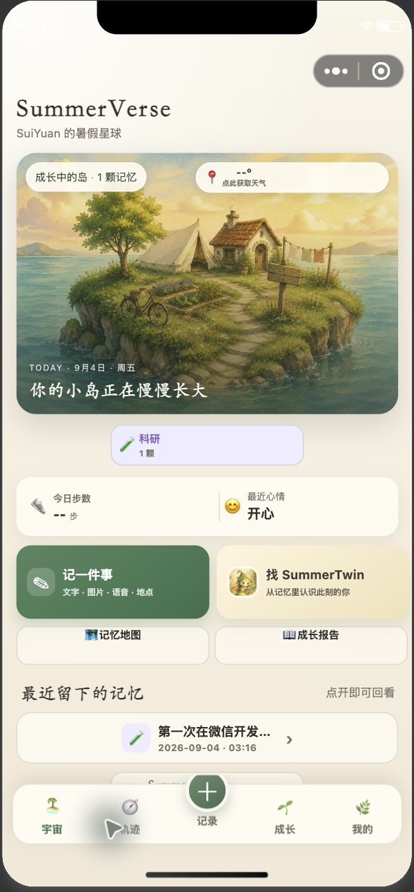
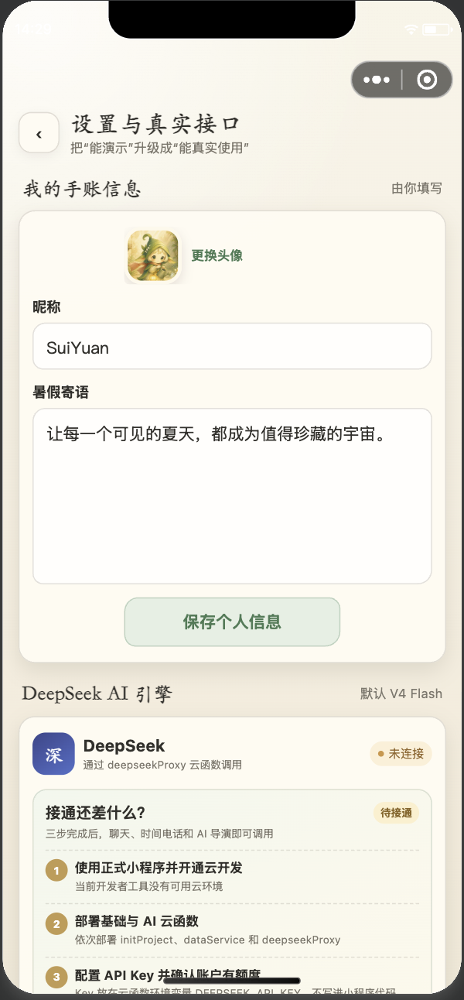

# SummerVerse｜暑假数字分身微信小程序

> 别人保存暑假照片，我们把暑假养成一颗会生长的小岛，并让 SummerTwin 住进由真实记忆长出的花园。

这是一个可直接导入微信开发者工具的原生小程序工程。默认不伪造步数、地图、天气或用户经历：未授权或未配置时显示空状态；演示数据只能由用户手动导入，并永久带有“示例”标记。

## 新版界面预览

| 小岛首页 | SummerTwin | DeepSeek 接通页 |
|---|---|---|
|  |  |  |

以上截图用于展示界面风格，来自早期开发版本；设置页旧截图中的环境变量 Key 提示已废弃。当前版本严格使用用户本次运行自行输入的 Key，不配置开发者或共享 Key。实际验收进展见 [验收状态](docs/ACCEPTANCE_STATUS.md)。

插图的统一风格和可复现提示词见 [docs/ARTWORK_PROMPTS.md](docs/ARTWORK_PROMPTS.md)。

## 已完成的功能

- **小岛星球首页**：根据真实记忆数量切换初生、成长、成熟三阶段；六类记忆形成可横向浏览的土地标签。
- **完整记录系统**：文字、分类、心情、日期、时长、照片、视频、语音、真实地点、重要度。
- **一句话 AI 记录**：DeepSeek 把自然语言整理成可编辑草稿，用户确认后才保存。
- **AI 看图补全**：照片先上传微信云存储，再由云函数调用 DeepSeek 视觉模型生成草稿。
- **真实时间轴与热力图**：搜索、分类筛选、日期分组、最近 28 天记录热力图。
- **真实地图轨迹**：原生 `map` 组件、真实经纬度 Marker、按时间连接的 Polyline。
- **真实微信步数**：`wx.getWeRunData` + `wx.cloud.CloudID` + 云函数解密。
- **实时天气**：用户主动授权位置后，由云函数调用 Open-Meteo。
- **目标与成长页**：目标增量、真实统计、七日情绪、可解释 AI 洞察。
- **SummerTwin 花园**：三阶段花园、证据式聊天、行为成长画像。
- **时间电话**：只向模型提供指定日期及以前的记忆。
- **平行暑假**：真实路线与 AI 生成路线永久分栏展示。
- **AI 夏日导演**：以真实记忆 ID 生成章节与旁白，并提供沉浸式播放和分享封面。
- **成长报告**：事实统计、推断画像、亮点记录和雷达图。
- **API 设置页**：默认 DeepSeek V4 Flash；严格使用每位用户自己的 API Key，仅本次运行有效；开发者不提供共享 Key。
- **云端 / 本机双模式**：启动时会真正调用 `dataService` 健康检查；只有云函数可访问时才进入云模式，否则使用本机存储。进入云模式后不会因为单次请求失败而暗中混入本机数据。

## 目录

```text
summerverse-miniprogram/
├── miniprogram/                 # 小程序前端
│   ├── pages/                   # 12 个页面
│   ├── components/              # 通用手账组件
│   ├── services/                # 数据、AI、微信接口、媒体服务
│   ├── utils/                   # 日期、统计、校验、存储
│   └── images/                  # 已压缩的手绘正式素材
├── cloudfunctions/
│   ├── initProject/             # 初始化数据库集合
│   ├── dataService/             # 用户数据 CRUD
│   ├── deepseekProxy/           # DeepSeek 安全代理
│   ├── weRunData/               # 微信运动开放数据解密
│   └── weather/                 # 实时天气代理
├── docs/                        # 部署、隐私、接口与验收文档
├── tests/                       # 纯逻辑单元测试
└── project.config.json
```

## 立即运行

1. 安装最新版微信开发者工具。
2. 导入本目录。如果开发者工具不接受 `touristappid`，在导入页选择“测试号”和“不使用云服务”即可预览本机模式。
3. 使用真实能力前，将 `project.config.json` 的 `appid` 替换为自己的 AppID。
4. 创建并关联微信云开发环境，必要时把环境 ID 写入 `miniprogram/config/env.js`。
5. 依次部署 `initProject`、`dataService`、`weRunData`、`weather`、`deepseekProxy`。
6. 用户在设置页填写自己的 DeepSeek API Key，确认数据发送和费用后点“测试连接”。云函数不配置开发者 Key。没有 Key 时基础手账仍可用，AI 功能明确提示未连接。

详细步骤见 [docs/CLOUD_SETUP.md](docs/CLOUD_SETUP.md)。

## 本地检查

```bash
npm run verify
```

检查内容包括：JS 语法、JSON 配置、页面文件完整性、WXML 事件绑定与路由、Canvas 2D、无效权限声明、意外 API Key、静态素材体积、项目完整性清单以及纯逻辑单元测试。修改文件后先运行 `npm run manifest`。

当前已验证与必须由账号所有者完成的项目见 [docs/ACCEPTANCE_STATUS.md](docs/ACCEPTANCE_STATUS.md)。
需要生成交付压缩包时运行 `npm run zip`，产物会写入 `dist/SummerVerse-WeChat-MiniProgram.zip`，且自动排除本机私有配置。

## 安全边界

- 正式 DeepSeek Key **不得**写入小程序源码、Git 仓库或本地 Storage。
- 用户 Key 只在本次运行内保留，应用不主动写入 Storage、数据库或日志；经腾讯云转发至固定的 DeepSeek 官方接口。部署时必须核对云平台请求参数采集设置。
- 位置、微信步数、照片、视频和麦克风只在用户主动点击相应功能时请求。
- “时间电话”“平行暑假”“成长画像”属于生成或推断能力，界面中与真实数据永久区分。

## 当前仍需由账号所有者完成的外部步骤

代码仍需真实账号和真机验收。以下事项不能由源码替代：注册/认证小程序、填写真实 AppID、创建云开发环境、部署云函数、配置环境变量、在公众平台声明隐私用途与申请相关接口权限、真机授权微信运动。详见文档中的上线清单。

## 多 Agent 协作

协作者或编码 Agent 请先阅读 [`AGENTS.md`](AGENTS.md) 与 [`docs/COLLABORATION.md`](docs/COLLABORATION.md)。任何改动提交前都应运行：

```bash
npm run verify
```

注册、上传和正式审核执行单见 [docs/RELEASE_PLAN.md](docs/RELEASE_PLAN.md)。
