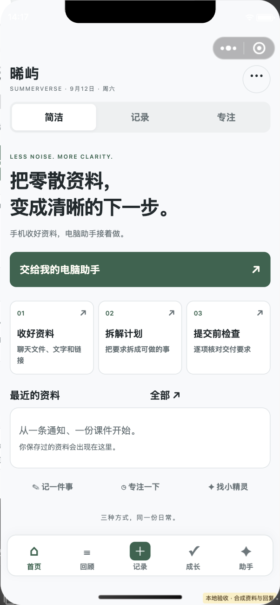
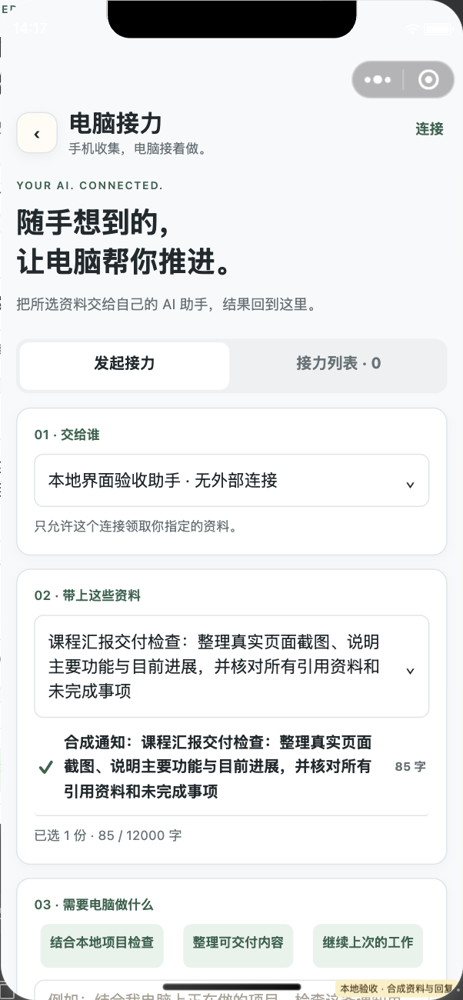
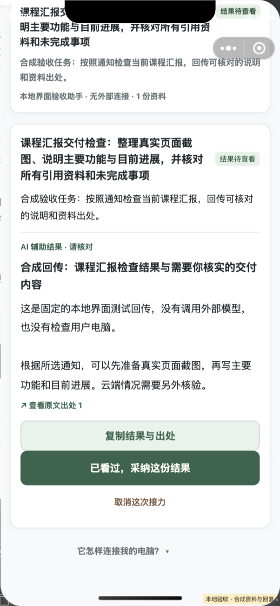

# SummerVerse 晞屿手记｜手机收集，电脑接着做

> 在手机收好通知、文档和网页，把选中的资料交给自己的电脑 AI 助手，处理结果回到手机。生活记录与会成长的小岛保留在同一个空间。

这是一个可直接导入微信开发者工具的原生小程序工程。默认不伪造步数、地图、天气或用户经历：未授权或未配置时显示空状态；演示数据只能由用户手动导入，并永久带有“示例”标记。

## 当前体验版 1.1.0

2026-09-12，四个配套云函数已部署并逐文件回读一致；公众平台确认14:44:45上传的1.1.0为体验版。备案、认证已完成，尚未提交代码审核或正式发布。电脑接力的公网入口仍关闭，真实电脑客户端尚未接通。

本轮主线是 **电脑接力**：手机选择资料和已授权连接 → Codex / Claude Code 等本地 MCP 客户端领取 → 在自己的项目环境里处理 → 回传简明结果与原文出处 → 手机核对、采纳或清除。助手只能领取明确交给它的资料；接收任务权限与近期记忆读取权限分开。接入步骤见 [MCP 使用说明](integrations/mcp/README.md)。公网入口与真实外部客户端联调尚未完成，不能把本地协议测试当作已经连上用户的电脑。

同时提供简洁、记录、专注三种界面，共享同一份数据。资料可拆成待确认行动，确认后进入任务与专注页；汇报练习保留在“更多场景”，不作为主打功能。首屏和时间轴减少传给视图层的数据；云连接失败保留云模式意图，给出重连入口；可能已保存的请求会保留去重身份，不盲目另建记录。

产品调研、取舍和国内模型文档核查见 [产品研究](docs/PRODUCT_RESEARCH_2026-09.md)。当前云端与体验版状态以 [验收状态](docs/ACCEPTANCE_STATUS.md) 为准；版本号变化不代表已部署、提审或上线。

| 简洁首页 | 发起电脑接力 | 回传结果与出处 |
|---|---|---|
|  |  |  |

这些是2026-09-12微信原生开发者工具的实际页面截图。资料、模型回复和电脑回传均为明确标记的隔离合成数据，用于验证交互与版面；不是跨设备实连证明。[记录模式](docs/screenshots/experience-v1/01-home-journal.png)、[专注模式](docs/screenshots/experience-v1/01-home-focus.png)也保留在同一版本。

## 记录模式的早期界面预览

| 小岛首页 | SummerTwin | DeepSeek 接通页 |
|---|---|---|
|  |  |  |

以上截图用于展示界面风格，来自早期开发版本；设置页旧截图中的环境变量 Key 提示已废弃。当前版本严格使用用户本次运行自行输入的 Key，不配置开发者或共享 Key。实际验收进展见 [验收状态](docs/ACCEPTANCE_STATUS.md)。

插图的统一风格和可复现提示词见 [docs/ARTWORK_PROMPTS.md](docs/ARTWORK_PROMPTS.md)。

## 已完成的功能

- **小岛星球首页**：根据真实记忆数量切换初生、成长、成熟三阶段；六类记忆形成可横向浏览的土地标签。
- **完整记录系统**：文字、分类、心情、日期、时长、照片、视频、语音、真实地点、重要度。
- **一句话 AI 记录**：DeepSeek 把自然语言整理成可编辑草稿，用户确认后才保存。
- **AI 看图补全**：照片先上传微信云存储，再由云函数调用 DeepSeek 视觉模型生成草稿。
- **真实时间轴与热力图**：搜索、分类筛选、日期分组、最近 28 天记录热力图。
- **真实地图轨迹**：原生 `map` 组件、真实经纬度 Marker、按时间连接的 Polyline。
- **真实微信步数**：`wx.getWeRunData` + `wx.cloud.CloudID` + 云函数解密。
- **实时天气**：用户主动授权位置后，由云函数调用 Open-Meteo。
- **目标与成长页**：目标增量、真实统计、七日情绪、可解释 AI 洞察。
- **SummerTwin 花园**：三阶段花园、证据式聊天、行为成长画像。
- **时间电话**：只向模型提供指定日期及以前的记忆。
- **平行暑假**：真实路线与 AI 生成路线永久分栏展示。
- **AI 夏日导演**：以真实记忆 ID 生成章节与旁白，并提供沉浸式播放和分享封面。
- **成长报告**：事实统计、推断画像、亮点记录和雷达图。
- **API 设置页**：默认 DeepSeek V4 Flash；严格使用每位用户自己的 API Key，仅本次运行有效；开发者不提供共享 Key。
- **云端 / 本机双模式**：启用云开发时保留云端数据模式，启动失败或断网给出明确状态和重连入口；只有明确关闭云开发的独立运行配置才使用本机数据。网络错误不会暗中切换存储位置。

## 外部助手与灵感收件箱（服务已部署，公网入口待开通）

新增「首页 → 电脑接力 → 连接」及「设置 → 灵感收件箱」：外部助手可投递记忆/目标草稿；用户另行允许“接收手机任务”后，手机也可向该连接派发所选资料。草稿由手机确认后保存；接力结果单独存放，采纳不会自动完成目标或增加真实记忆。默认仅投递，近期读取与接收任务均需主动授权，连接可撤销。实现与部署边界见 [接入说明](docs/ASSISTANT_BRIDGE.md)。

## 资料分析（含公开网页导入，已随1.1.0交付体验版）

云函数和资料库已部署并回读。隐私指引上次检查显示审核中，但待审正文回读异常、保存完整性尚未确认；网页与电脑接力用途补充说明仍待提交。真实微信身份下的资料往返和用户自填Key的模型效果仍待验收，尚未提审或正式发布。见 [最新验收状态](docs/ACCEPTANCE_STATUS.md)。

首页「收好资料」可进入资料工作台。主动选择聊天文件、图片或粘贴文字后，可提取要求、对比变更、按资料提问、拆解计划和生成检查清单；更多场景中保留讨论纪要与汇报练习。点击「网页链接」粘贴公开网址，经确认后由腾讯云提取纯文字；提取本身不需要模型Key，AI分析使用用户自己的Key。每条有依据的结果可展开提取片段；确认后才加入任务，完成状态手动勾选。保存过的资料可重新打开，也可选择资料交给已授权的电脑助手。

支持文字层 PDF、DOCX、PPTX、UTF-8 TXT/MD、JPG/PNG/WebP 识图及公开网页纯文字提取。需要登录、验证码、付费或脚本渲染的网页需改用复制文字或截图。小程序无法直接读取完整群聊或微信原生语音消息，聊天选择器也不能直接选择文字或链接消息。文件/网页「用小程序打开」入口仍取决于体验版配置、微信平台和正式发布。功能边界、源码入口和部署清单见 [资料分析说明](docs/MATERIALS.md)。

## 工程目录

```text
summerverse-miniprogram/
├── miniprogram/                 # 小程序前端
│   ├── pages/                   # 16 个页面（含电脑接力、专注）
│   ├── components/              # 通用手账组件
│   ├── services/                # 数据、AI、微信接口、媒体服务
│   ├── utils/                   # 日期、统计、校验、存储
│   └── images/                  # 已压缩的手绘正式素材
├── cloudfunctions/
│   ├── initProject/             # 初始化数据库集合
│   ├── dataService/             # 用户数据 CRUD
│   ├── deepseekProxy/           # 国内模型 BYOK 与资料解析
│   ├── assistantInbox/          # 微信身份下的助手连接、草稿及接力管理
│   ├── assistantGateway/        # 电脑助手授权接口（公网入口待核验）
│   ├── weRunData/               # 微信运动开放数据解密
│   └── weather/                 # 实时天气代理
├── docs/                        # 部署、隐私、接口与验收文档
├── tests/                       # 纯逻辑单元测试
└── project.config.json
```

## 立即运行

1. 安装最新版微信开发者工具。
2. 导入本目录。隔离本机预览请复制工程、选择测试号，并在副本的 `miniprogram/config/env.js` 明确关闭 `ENABLE_CLOUD`；不要改动正式工程来制造假云连接。
3. 使用真实能力前，将 `project.config.json` 的 `appid` 替换为自己的 AppID。
4. 创建并关联微信云开发环境，必要时把环境 ID 写入 `miniprogram/config/env.js`。
5. 依次部署 `initProject`、`dataService`、`weRunData`、`weather`、`deepseekProxy`。
6. 用户在设置页填写自己的 DeepSeek API Key，确认数据发送和费用后点“测试连接”。云函数不配置开发者 Key。没有 Key 时基础手账仍可用，AI 功能明确提示未连接。

详细步骤见 [docs/CLOUD_SETUP.md](docs/CLOUD_SETUP.md)。

## 本地检查

```bash
npm ci --prefix cloudfunctions/deepseekProxy --ignore-scripts
npm run verify
```

PDF/Office 解析测试需要上述云函数依赖；云端使用 Node.js 20.19，建议本地使用 Node.js 20 或更新版本。仅查看页面不需要安装这些依赖。

检查内容包括：JS 语法、JSON 配置、页面文件完整性、WXML 事件绑定与路由、Canvas 2D、无效权限声明、意外 API Key、静态素材体积、项目完整性清单以及纯逻辑单元测试。修改文件后先运行 `npm run manifest`。

当前已验证与必须由账号所有者完成的项目见 [docs/ACCEPTANCE_STATUS.md](docs/ACCEPTANCE_STATUS.md)。
需要生成交付压缩包时运行 `npm run zip`，产物会写入 `dist/SummerVerse-WeChat-MiniProgram.zip`，且自动排除本机私有配置。

## 安全边界

- 正式 DeepSeek Key **不得**写入小程序源码、Git 仓库或本地 Storage。
- 用户 Key 只在本次运行内保留，应用不主动写入 Storage、数据库或日志；经腾讯云转发至固定的 DeepSeek 官方接口。部署时必须核对云平台请求参数采集设置。
- 位置、微信步数、照片、视频和麦克风只在用户主动点击相应功能时请求。
- “时间电话”“平行暑假”“成长画像”属于生成或推断能力，界面中与真实数据永久区分。

## 当前剩余的外部步骤

本项目的注册、认证、备案、云环境、配套函数部署及1.1.0体验版上传已完成。剩余是选择可接受的公网入口费用与保护方案，连接用户指定的电脑MCP客户端后做跨设备验收；核对并补齐平台隐私正文与相关接口权限，集中完成真实微信身份和硬件能力测试，最后再提交代码审核。源码、控制台登录和备案通过不能代替这些验收。

## 多 Agent 协作

协作者或编码 Agent 请先阅读 [`AGENTS.md`](AGENTS.md) 与 [`docs/COLLABORATION.md`](docs/COLLABORATION.md)。任何改动提交前都应运行：

```bash
npm run verify
```

注册、上传和正式审核执行单见 [docs/RELEASE_PLAN.md](docs/RELEASE_PLAN.md)。
