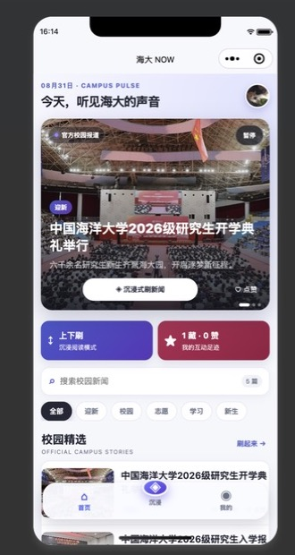
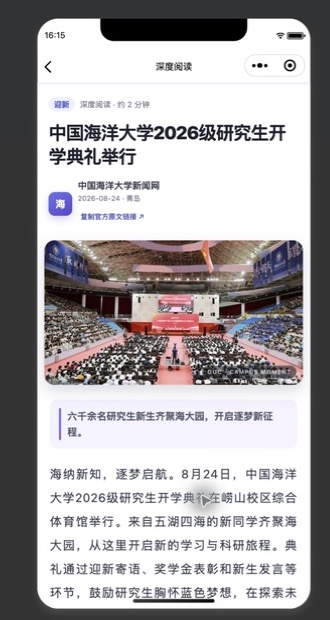

# 实验三：高校新闻网

一个以中国海洋大学校园新闻为主题的原生微信小程序。项目在新闻列表、详情阅读和本地收藏等实验要求上，增加了沉浸式纵向新闻流、横向手势操作、点赞系统、阅读进度、微信头像昵称填写能力和自定义悬浮导航。所有新闻图片均保存在本地，不依赖云开发或后端服务。

## 运行效果

首页、沉浸式新闻流和新闻详情页的实际运行效果如下。

<table>
  <tr>
    <td align="center"><br>首页</td>
    <td align="center"><br>沉浸式互动</td>
    <td align="center"><br>新闻详情</td>
  </tr>
</table>

## 功能说明

### 首页

- 使用 3 张大幅焦点卡片自动轮播头条新闻，并提供暂停/继续控制；
- 支持关键词搜索和新闻分类筛选；
- 保存资料后展示当前收藏数与点赞数；
- 可以从首页一键进入沉浸式阅读模式；
- 新闻列表支持快捷点赞和详情跳转。

### 沉浸式新闻流

- 上下滑动切换不同新闻；
- 向右滑动当前新闻可加入收藏；
- 向左滑动当前新闻可点赞；
- 手势成功后显示浮层动画并触发轻触震动；
- 页面显示阅读序号、新闻分类、预计阅读时间和互动状态；
- 操作侧栏也可以直接切换上一条/下一条、点赞、收藏或进入全文。

### 新闻详情

- 展示新闻标题、图片、摘要、正文、日期和来源；
- 顶部阅读进度条随页面滚动变化；
- 支持点赞、收藏、取消操作和微信分享；
- 点赞与收藏状态会与首页、沉浸页和个人中心同步。

### 个人中心

- 使用微信原生 `chooseAvatar` 头像选择和 `nickname` 昵称填写组件；
- 分别统计本地收藏与点赞数量；
- 可以在“收藏”和“点赞”两类阅读足迹之间切换；
- 新收藏、新点赞的新闻会自动排在列表最前；
- 可以直接在足迹列表取消收藏或点赞，无需先进入详情页；
- 游客状态的点赞与收藏不属于已保存资料，首次保存资料后足迹从 0 开始；
- 游客互动会在首页和“我的”页明确标记并显示暂存数量，保存资料前仍可查看和取消；
- 退出时会二次确认，并清理当前资料、头像和互动记录；清理失败时会在下次启动后重试；
- 支持从足迹列表重新进入新闻详情；
- 提供沉浸式新闻流的快捷入口。

## 手势说明

```text
                上滑 / 下滑
                切换新闻
                    ↑
左滑点赞  ←  当前新闻  →  右滑收藏
```

横向手势只有在水平位移明显大于垂直位移时才会触发，因此不会影响正常的上下刷新闻操作。

## 运行方式

1. 打开微信开发者工具，选择“导入项目”。
2. 选择当前 `lab03-campus-news-miniprogram/` 目录。
3. 点击“编译”，在模拟器中查看首页。
4. 点击底部中间的“沉浸”按钮体验纵向新闻流和横向手势。
5. 在“我的”页面通过微信原生控件选择头像、确认昵称并保存本机资料，然后查看收藏和点赞足迹。

## 项目结构

```text
lab03-campus-news-miniprogram/
├── app.js
├── app.json
├── app.wxss
├── custom-tab-bar/         # 自定义悬浮底部导航
├── images/                 # 本地新闻图片与图标
├── pages/
│   ├── index/              # 首页、搜索和分类筛选
│   ├── immersive/          # 沉浸式纵向新闻流与横向手势
│   ├── detail/             # 新闻详情、阅读进度和互动
│   └── my/                 # 本机资料和阅读足迹
├── utils/
│   ├── common.js           # 本地新闻数据和查询函数
│   └── storage.js          # 本机资料、点赞和收藏状态管理
├── project.config.json
└── sitemap.json
```

## 数据说明

新闻标题、日期和图片取自中国海洋大学新闻网公开报道，每条数据均保留原文 URL；正文在项目中整理为适合课程演示的简短摘要，阅读时间根据正文长度估算。游客与已保存资料使用两套本地存储键：游客状态的收藏和点赞会暂存在本机，首次保存资料后，新的资料足迹从 0 开始。头像、昵称和互动记录也保存在本地，因此清除缓存后会被移除，暂不支持跨设备同步。

- [中国海洋大学2026级研究生开学典礼举行](https://news.ouc.edu.cn/2026/0824/c91a122559/page.htm)
- [中国海洋大学2026级研究生入学报到](https://news.ouc.edu.cn/2026/0824/c91a122555/page.htm)
- [中国海大志愿者完成第五届跨国公司领导人青岛峰会志愿服务](https://news.ouc.edu.cn/2024/0831/c91a117197/page.htm)
- [贵州省人大干部综合能力提升培训班在中国海洋大学举办](https://news.ouc.edu.cn/2024/0830/c550a117188/page.htm)
- [中国海洋大学开展2024级本科生集中入学教育](https://news.ouc.edu.cn/2024/0829/c550a117172/page.htm)

课程结构与基础功能要求来自 [实验3：高校新闻网](https://oucai.club/classes/Mobile/lab03)。新闻、点赞、收藏和用户展示信息均保存在微信小程序本地缓存中，不会上传到服务器。
