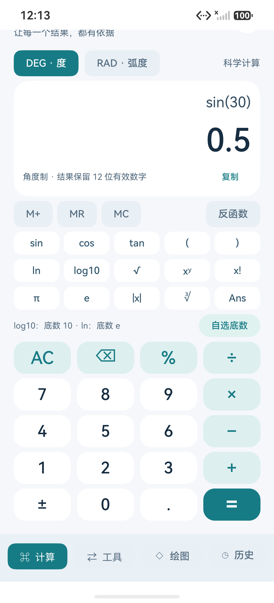
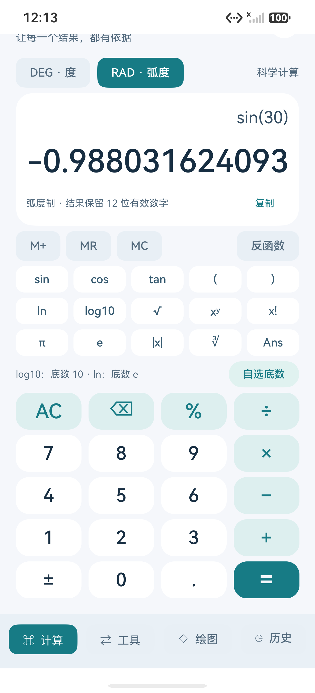
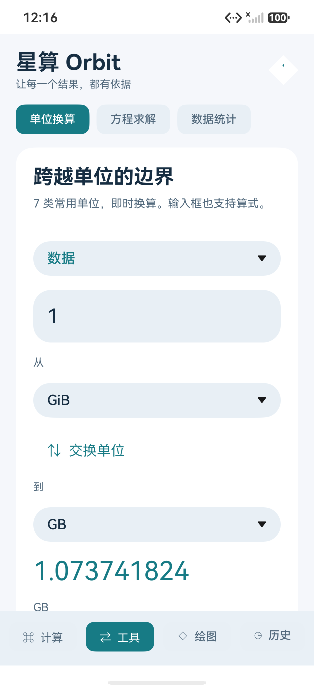
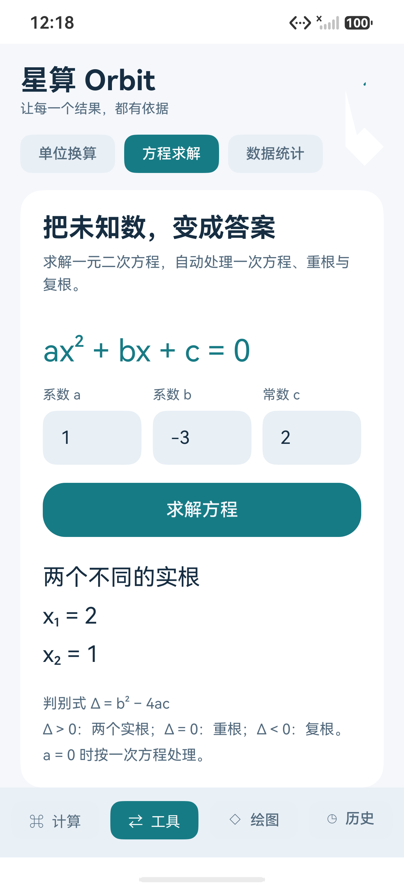
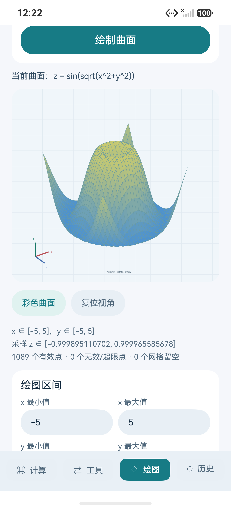
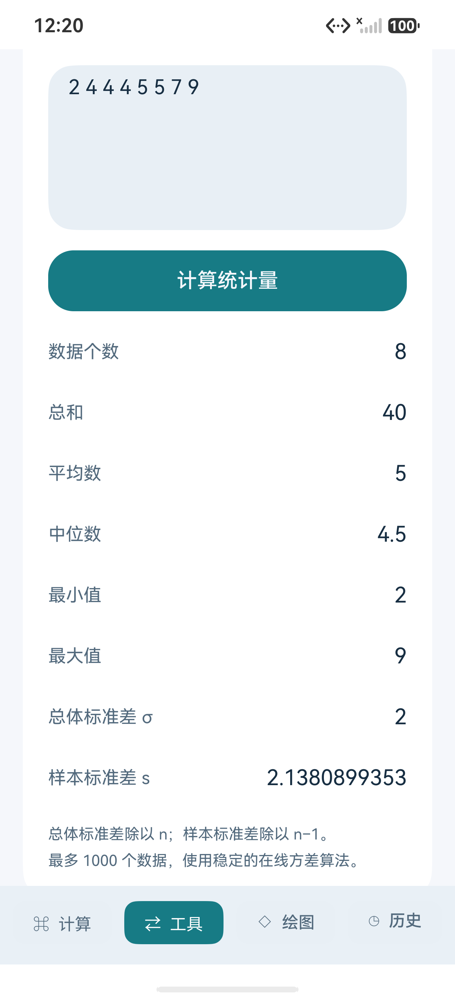
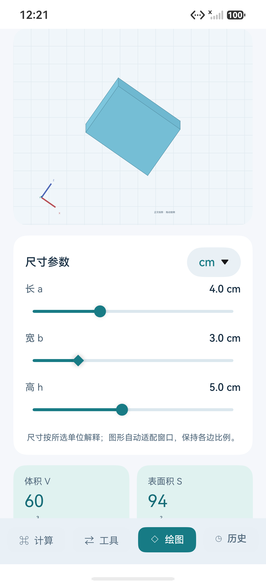
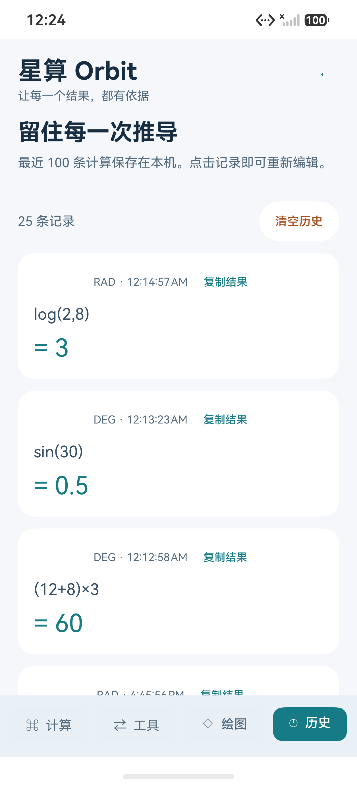

# 星算 Orbit · 鸿蒙科学计算器

中国海洋大学《移动软件开发》Lab05。使用 ArkTS / ArkUI 编写的原生、离线科学计算器，无网络权限、无登录、无广告。

界面采用浅灰蓝背景、白色卡片与青绿色重点按钮。底部有计算、工具、绘图、历史四个入口。「绘图」默认打开函数曲面，另可切换到几何体。

课程原文：[实验 5：鸿蒙开发入门及计算器开发](https://oucai.club/classes/Mobile/lab05)。在基础计算器的要求上增加日常学习可用的科学函数与计算工具。

## 运行效果

以下为本地 HarmonyOS 手机模拟器的真实运行截图。图片随源码保存在仓库中，点击可查看原图。

### 科学计算与角度模式

同一算式切换 DEG/RAD 后，选中按钮与当前结果同步更新。

<table>
  <tr>
    <td align="center"><br>科学计算：括号与四则运算</td>
    <td align="center"><br>角度制：sin(30) = 0.5</td>
    <td align="center"><br>弧度制：切换后立即重算</td>
  </tr>
</table>

### 自选对数底数与实用工具

对数分别填写底数与真数；容量换算区分 GiB 与 GB，方程工具直接展示实根。

<table>
  <tr>
    <td align="center"><br>自选底数：log₂(8) = 3</td>
    <td align="center"><br>数据容量：1 GiB 转为 GB</td>
    <td align="center"><br>方程求解：两个实根</td>
  </tr>
</table>

### 输入函数，生成三维曲面

输入 `z = f(x,y)` 后生成可旋转的彩色曲面；下面分别展示波纹函数和手动输入 `x^2-y^2` 得到的马鞍面。

<table>
  <tr>
    <td align="center"><br>波纹：sin(sqrt(x²+y²))</td>
    <td align="center"><br>输入 x²−y² 生成马鞍面</td>
  </tr>
</table>

### 统计、几何与历史

统计展示 8 项指标，几何体同步展示尺寸与计算结果，历史记录在重启应用后仍保留。

<table>
  <tr>
    <td align="center"><br>数据统计：平均数与标准差</td>
    <td align="center"><br>几何体：尺寸、体积与表面积</td>
    <td align="center"><br>重启后仍保留的计算历史</td>
  </tr>
</table>

## 功能

| 页面 | 已实现能力 |
| --- | --- |
| 计算 | 四则运算、括号、负数、百分数、乘方、平方根、立方根、阶乘、绝对值、π、e、科学计数法 |
| 科学函数 | sin/cos/tan、反三角函数、ln/log10、角度 DEG / 弧度 RAD 切换 |
| 对数底数 | `log10(x)` 明确以 10 为底，`ln(x)` 以 e 为底；“自选底数”分别填写底数与真数，也可输入 `log(2,8)` 得 3。旧历史中的单参数 `log(x)` 继续兼容底数 10 |
| 连续计算 | Ans 使用上次未舍入结果；M+ 累加、MR 读取、MC 清空本次会话记忆 |
| 换算 | 长度、质量、温度、面积、体积、速度、数据容量；支持交换单位、表达式输入；明确 KB/GB 与 KiB/GiB |
| 方程 | ax²+bx+c=0，支持两个实根、重根、共轭复根；a=0 自动退化为一次方程 |
| 统计 | 个数、和、平均数、中位数、最小/最大、总体与样本标准差；支持空格、逗号、换行，最多 1000 个数据 |
| 历史 | 本机持久保存最近 100 条、恢复算式与角度模式、复制结果、确认后清空 |
| 立体几何 | 长方体、正方体、球、圆柱、圆锥、正四棱锥；拖动旋转、视角滑块、缩放、实体/线框切换；调整尺寸即时更新模型、体积、含底面的总表面积与公式 |
| 函数曲面 | 输入 z=f(x,y) 生成彩色三维曲面；可修改 x/y 区间、绝对高度上限及采样精度；旋转、缩放、线框；内置波纹、马鞍、山峰、抛物面、波浪、半球示例 |
| 说明 | 内置优先级、百分数定义、单位和精度说明；错误输入有明确提示 |

## 运行环境与存放方式

- 已使用 DevEco Studio 26.0.0.821、HarmonyOS SDK 26.0.0、Pura 90 Pro 模拟器构建。
- `lab05-harmonyos-calculator` 是本仓库中的唯一源码入口，上传 GitHub 时提交此目录。
- 源码路径含中文时，构建脚本将源码同步至单独的 ASCII 构建目录，再调用官方构建工具。该目录是可重新生成的副本，不是第二个源码仓库；修改应在本仓库进行。
- 个人安装路径、构建路径及外盘 UUID 放在被忽略的 `.orbit.local.env`，不提交 Git。外盘构建会核验卷 UUID 与实际挂载点；未连接或身份不符时停止。没有后台同步服务。
- 构建目录不能与源码仓库、DevEco 目录重叠，不能直接使用个人目录、系统目录或磁盘根目录；非空目录须为既有 Orbit 构建副本，不能用于其他项目。
- HAP、SDK、模拟器镜像、编译缓存和个人签名均不提交 Git。

先设置 `DEVECO_STUDIO_DIR`（DevEco 的 Contents 目录）和 `ORBIT_BUILD_DIR`（专用 ASCII 构建目录）。可以在本项目根创建 `.orbit.local.env` 保存本机设置；这是由脚本读取的可信本地 shell 配置，不要使用不明来源内容。变量赋值示例：

```sh
DEVECO_STUDIO_DIR='/Applications/DevEco-Studio.app/Contents'
ORBIT_BUILD_DIR="$HOME/HarmonyOSBuilds/orbit"
# 只有使用外盘时需要：填入自己的实际挂载点和 Volume UUID。
# ORBIT_VOLUME_PATH='/Volumes/YourDrive'
# ORBIT_VOLUME_UUID='your-volume-uuid'
```

也可直接通过环境变量传入这些值。在本项目目录运行：

```sh
bash scripts/build.sh
# 先在设备管理器启动 Pura 90 Pro，再安装并启动应用：
bash scripts/run-emulator.sh
```

模拟器设备通过 `ORBIT_DEVICE` 指定，默认 `127.0.0.1:5555`。外盘安装/构建需要同时指定 `ORBIT_VOLUME_PATH` 和 `ORBIT_VOLUME_UUID`，当前脚本支持一个外盘卷。当前配置使用 API 26，未承诺旧 SDK 或旧系统兼容。

测试使用 DevEco 内的 Node 与 TypeScript，无需额外下载安装。完成上述本机配置后运行全部四组测试：

```sh
bash scripts/test.sh
```

独立运行 `node tests/core.test.cjs` 等测试时，通过 `TYPESCRIPT_PATH` 指定 TypeScript 模块目录，或通过 `DEVECO_STUDIO_DIR` 使用 DevEco 自带版本；也支持已安装的本地 TypeScript。测试不会给应用安装第三方运行依赖。

当前 HAP 为模拟器调试用未签名包，已在此本地模拟器成功安装。真机和发布需要用户自己的正式签名，不能直接将此包当成商店发行版。

## 算法与规则

- 递归下降解析器处理算式，不执行用户输入，也不使用 `eval`。
- 乘方右结合：`2^3^2 = 512`；`-2^2 = -4`；`(-2)^2 = 4`。
- `%` 始终表示除以 100：`200×15% = 30`，`200+10% = 200.1`，不隐含“增加百分之几”。
- 支持 `2π`、`2(3+4)`、`2sin(30)` 等隐式乘法；函数需完整括号。
- 二次方程使用缩放系数及稳定求根形式，减少大小根相减的抵消误差；统计使用 Welford 方差算法。
- 使用 IEEE 754 双精度，显示 12 位有效数字；不是任意精度数学软件。除零、无定义函数、溢出和已检测到的极端精度损失明确报错。非常接近的数仍受浮点舍入限制。
- 普通计算以实数为范围；方程工具单独支持共轭复根。
- DEG/RAD 切换后立即按新模式重新计算当前算式；不自动转换输入角度数值。例如 `sin(30)` 在 DEG 为 0.5，在 RAD 约为 -0.98803。切换不会新增历史；按等号或自选底数计算时保存。重复切换保留该算式原有的 Ans 操作数，避免累加漂移；无定义或未完成算式显示提示。
- 立体几何以三维顶点、旋转矩阵、深度排序与正交投影绘制到原生 Canvas。尺寸范围 1～10，步长 0.1；cm/m 是输入尺寸的单位选择，不是现有尺寸的换算开关。模型自动适配窗口，保持相对比例。
- 球体、圆柱、圆锥使用有限面片近似显示，体积与面积使用解析公式计算，不以网格近似值代替。另有二元函数曲面绘图，不包含 CAD 建模、隐式方程曲面或参数曲面。
- 函数输入示例：`sin(sqrt(x^2+y^2))`、`x^2-y^2`、`3*exp(-(x^2+y^2)/2)`。可带 `z=` 前缀；变量为小写 x/y，乘法建议写 `*`，三角函数固定使用弧度。仅含 x 的函数沿 y 方向延展。
- 曲面三轴独立适配显示空间，图下标明输入区间与采样 z 范围；蓝色低、黄色高。默认 32×32 网格，可改为 48×48。超限/未定义顶点和检测到突变的网格留空。有限采样不能证明连续性，也可能漏掉窄峰或未采中的奇点，范围是采样结果，不是解析极值。

## 项目结构

```text
AppScope/                         应用名称、版本与图标
entry/src/main/ets/
  entryability/EntryAbility.ets    原生应用入口
  pages/Index.ets                 计算 / 工具 / 历史界面
  core/Calculator.ts             解析器、换算、方程、统计
  core/Geometry.ts               几何公式、三维网格与旋转投影
  pages/GeometryPanel.ets         原生 Canvas 立体交互页
  core/Surface.ts                二元函数网格采样与无效区域过滤
  pages/FunctionSurface.ets       函数输入、区间与彩色三维曲面
tests/core.test.cjs                数学行为回归测试
tests/geometry.test.cjs            几何公式及投影回归测试
tests/surface.test.cjs             变量、采样、区间、奇点与裁剪测试
scripts/                          可重复构建与模拟器运行入口
```

## 演示顺序

1. 计算 `(12+8)×3` 得 60，展示四则与括号。
2. DEG 模式计算 `sin(30)^2+cos(30)^2` 得 1；切到 RAD 后计算 `sin(π/2)` 得 1。
3. 计算 `200×15%` 得 30，再用 `Ans×2` 得 60；展示记忆和复制。
4. 数据容量中将 1 GiB 转为 GB，得到 1.073741824。
5. 方程 `1, -3, 2` 得 2 和 1；改为 `1, 0, 1` 得 ±i。
6. 统计 `2 4 4 4 5 5 7 9` 得平均数 5、总体标准差 2。
7. 在历史恢复一条计算；重启应用查看保存；输入 `1÷0` 展示错误处理。
8. 打开「绘图」，输入 `x^2-y^2` 并点击绘制，观察马鞍面；换成 `sqrt(9-x^2-y^2)` 观察半球及定义域外留空。
9. 在「绘图」切换「几何体」，选择圆锥，半径 3、高 4 时，体积为 12π、总表面积为 24π；拖动观察，切换线框，再调整半径查看变化。

验收范围见 [验证说明](docs/VALIDATION.md)。项目由 AI 辅助实现；提交前应理解核心算法并按老师要求如实说明辅助使用情况。

## 实验报告

[CSDN：鸿蒙实验五科学计算器与函数三维曲面的设计与实现](https://blog.csdn.net/2401_87150440/article/details/164508610)，包含 11 张实际模拟器截图、实现说明和调试记录。
