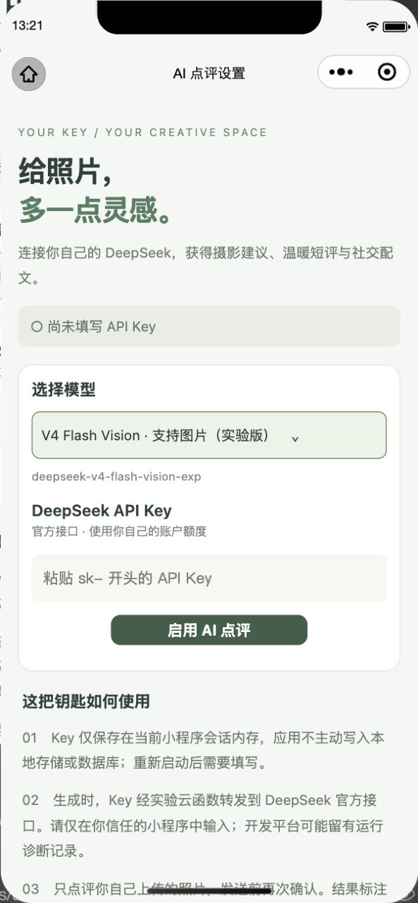
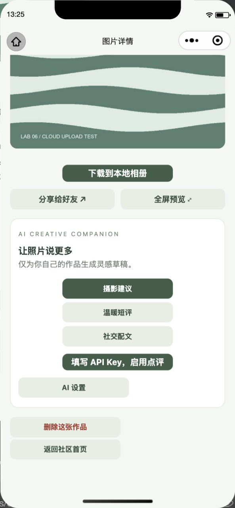

# 海边相册 · 图片分享社区

中国海洋大学《移动软件开发》实验六。使用微信原生小程序与云开发实现照片分享，在基础功能上加入 AI 照片点评、模型选择和作品删除。

## 运行效果

<table>
  <tr>
    <td align="center"> 社区首页</td>
    <td align="center"> 个人主页</td>
    <td align="center"> 上传照片</td>
  </tr>
</table>

<table>
  <tr>
    <td align="center"> 全屏预览</td>
    <td align="center"> AI 模型设置</td>
    <td align="center"> 照片点评与删除</td>
  </tr>
</table>

截图来自微信开发者工具。AI 图片展示设置与操作入口，实际生成需填写有效 Key 并使用支持图片的模型。

## 功能

- 浏览照片：社区按时间展示作品，支持刷新、分页和个人主页。
- 发布作品：从相册或相机选图，填写昵称、标题与可选地点，查看上传历史。
- 查看详情：全屏预览、保存到相册，并通过微信分享作品。
- AI 点评：使用自己的 DeepSeek Key，选择模型与点评风格，结果作为草稿展示。
- 删除作品：仅本人可删除；文件清理失败时提供重试入口。

作品归属按微信账号识别，昵称只是展示名称。同一账号统一显示最近一张未删除作品使用的昵称，不会因为昵称相同而合并不同账号。

AI Key 仅保存在当前运行内存，重启后需要重新填写。生成前会确认发送照片与标题并使用自己的账户额度；应用不设置固定等待间隔，只阻止尚未结束的重复请求。模型是否支持图片会在选择时明确标注。

## 运行方法

1. 使用微信开发者工具导入本目录，并填写自己有开发权限的 AppID。
2. 按[云环境配置说明](docs/CLOUD_SETUP.md)准备数据库、索引和云存储，更新工程的环境配置。
3. 将 `cloudfunctions/` 中的身份、图片访问、AI 点评和作品删除函数部署到同一云环境。
4. 编译小程序后即可上传照片；AI 功能在“AI 设置”中填写自己的 Key。

课程环境已配置。更换云环境时，需要同步修改各函数的图片路径校验配置。不要将 AppSecret、API Key 或登录凭据写入工程。

## 项目结构

- `miniprogram/`：页面、样式与数据服务。
- `cloudfunctions/`：微信身份、图片访问、AI 点评和作品删除。
- `docs/`：云环境配置、验证说明与运行截图。
- `tests/`：数据流程与异常处理的回归测试。

在本目录运行 `npm test` 可检查主要逻辑。实际联调范围与仍待验证的场景见[验证说明](docs/VALIDATION.md)。

参考：[课程实验说明](https://oucai.club/classes/MobileDev.html)。
