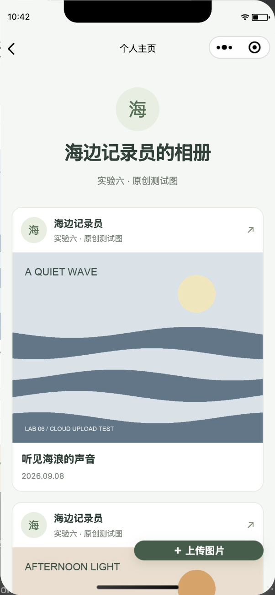
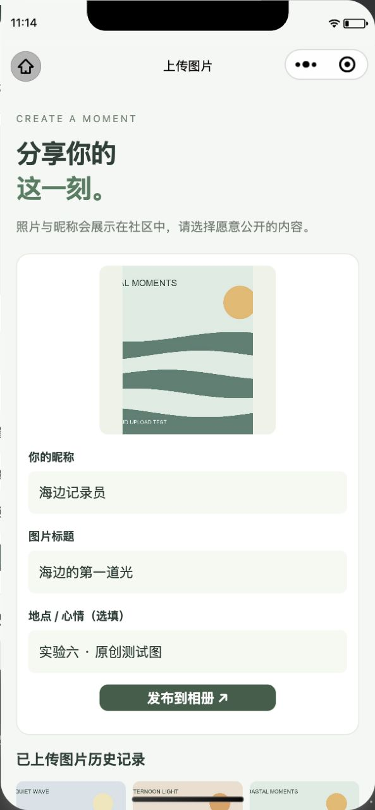
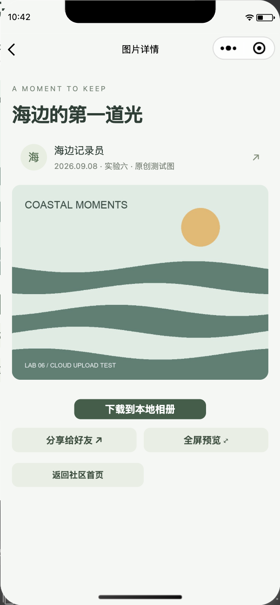
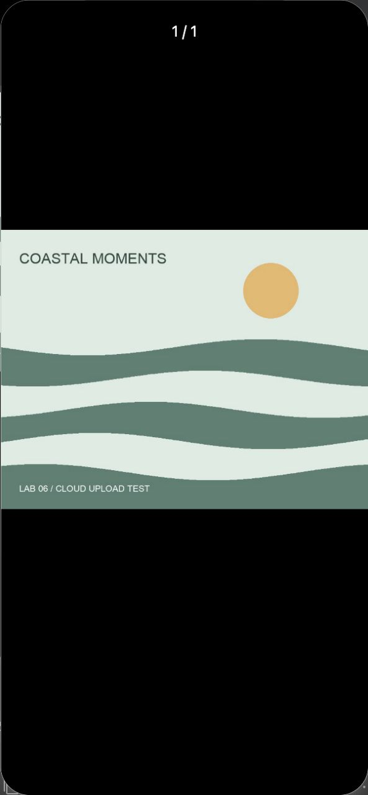
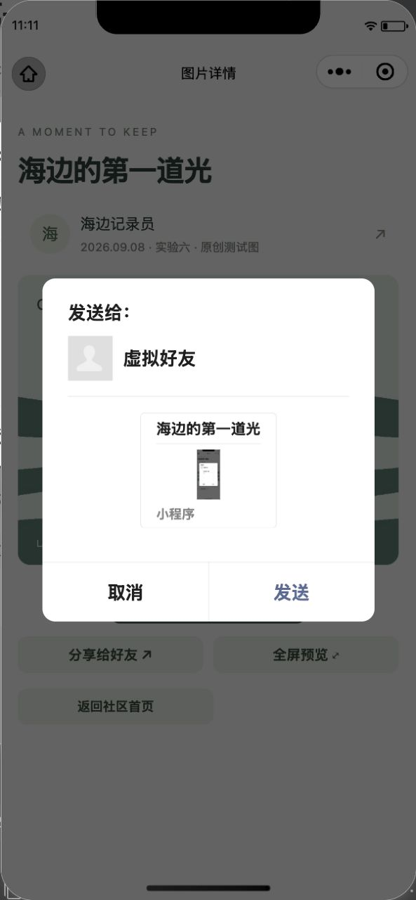

# 海边相册 · 图片分享社区

微信原生小程序，使用云数据库、云存储和云函数实现图片分享。采用浅绿相册界面，包含社区首页、作者主页、图片详情和上传页面。

## 功能

- 社区按上传时间倒序展示照片，支持下拉刷新、分页和作者主页。
- 从相册或相机选择一张图片，填写昵称、标题与可选地点，发布到云端。
- 上传记录通过平台自动维护的 `_openid` 归属作者；昵称首字作为头像。
- 图片详情支持微信好友分享、全屏预览与保存到系统相册。
- 上传成功后才写数据库；数据库超时保留待确认记录，重试使用同一 ID 和图片，避免重复上传。
- 未配置云环境时展示连接提示，不生成虚假作品或把本地数据当作云数据。

## 运行

1. 使用微信开发者工具导入本目录，填写自己有开发权限的 AppID。仓库已配置本课程使用的 AppID；其他账号运行时请替换为自己的 AppID。
2. 准备云开发环境，本课程环境已配置；更换环境时将其 ID 填入 `miniprogram/config.js` 的 `envId`。
3. 在指定环境中新建 **lab06_photos** 集合，权限选择“所有用户可读，仅创建者可读写”，或使用 `database.rules.json`。该集合对应教材的 `photos`，加前缀便于与其他项目隔离。
4. 为列表建立 `createdAt` 降序、`_id` 降序索引；为个人列表建立 `_openid` 升序、`createdAt` 降序、`_id` 降序复合索引。定义见 `database.indexes.json`；本课程环境中两个索引已创建并读回确认。
5. 在开发者工具中为 `cloudfunctions` 选择同一个环境，分别右击 **lab06_getOpenid** 和 **lab06_photoAccess**，选择“上传并部署：云端安装依赖”。身份函数对应教材的 `getOpenid`，图片访问函数仅为已发布且路径与作者匹配的记录生成临时下载地址。更换环境还须修改 `lab06_photoAccess/policy.js` 中完整的环境与桶路径。
6. 云存储保留“仅创建者可读写”，示例为 `storage.rules.example.json`。共享桶无需开放公共读取。图片访问函数严格校验记录 ID、平台作者、完整环境及桶路径，只为本实验已发布记录签发临时 URL。
7. 编译后上传自己愿意公开的测试照片，核对数据库记录与云文件，重新启动并再次读取。

AppID 与环境 ID 是项目标识，不需要在工程中存放 AppSecret、API Key 或登录凭据。共享环境只使用本项目命名的集合、函数和 `lab06/photos/<openid>/<recordId>.<ext>` 文件路径；存储保持私有，签名服务的作者与记录绑定构成访问边界。

## 数据与可靠性

`lab06_photos`：`_id`、平台自动设置的 `_openid`、`photoUrl`（cloud file ID，路径绑定作者和记录）、`nickName`、`title`、`location`、`createdAt`（服务器时间）。客户端不自行指定 `_openid`，云函数从 `cloud.getWXContext()` 获取身份。

如果图片上传后网络中断，应用保留待确认作品。写入响应异常时按固定 ID 查询，已写入且作者、图片匹配则确认成功，否则保留“重试发布”。不因超时自动删除图片，以免破坏实际上已成功的作品。本机存储不可用时会明确提示尚未发布，需在实验文件前缀下核对孤立文件；清理不自动执行。

昵称由用户主动填写，地点为可选文本，不读取定位。照片和昵称向社区用户公开；发布前应取得所摄人物同意。正式对公众运营前还需要按微信要求完成隐私声明、内容审核、投诉处理和配额治理；当前定位是课程实验工程。

## 检查

```sh
npm test
```

25 项回归测试覆盖模拟云接口的失败路径、幂等重试、签名访问边界，以及原生下载/保存接口的回调时序。真实服务联调与尚未覆盖的手机、多账号场景见 [验证说明](docs/VALIDATION.md)。

目录：`miniprogram/` 为原生页面和服务，`cloudfunctions/` 为身份及图片访问函数，`tests/` 为逻辑回归测试。

参考：[课程实验](https://oucai.club/classes/MobileDev.html)、[CloudBase 安全规则](https://docs.cloudbase.net/rule/rule-example)、[微信头像昵称能力](https://github.com/wechat-miniprogram/mp-user-avatar)。

## 运行效果

已在真实云环境完成三张原创测试图上传、数据库归属核对、社区列表、个人主页、上传历史和图片下载；两个云函数、集合权限及两个复合索引已配置。原生选图、全屏预览、分享卡片预览和模拟器保存均已实际操作，保存文件与原图哈希一致。详见 [验证说明](docs/VALIDATION.md)。

<table><tr>
<td><br>社区首页</td>
<td><br>作者相册</td>
<td><br>原生选图</td>
</tr><tr>
<td><br>图片详情</td>
<td><br>全屏预览</td>
<td><br>分享预览</td>
</tr></table>

截图来自微信开发者工具，使用明确标注的原创测试图。手机相册授权及双账号权限尚未实测。

## AI 照片点评（自带 DeepSeek Key）

首页点「AI 点评」进入设置，选择模型并填写自己的 Key；打开自己发布的照片，选择摄影建议、温暖短评或社交配文，再确认发送。结果为 AI 草稿，不自动发布为评论。

- 默认 `deepseek-v4-flash-vision-exp`（实验视觉模型）。下拉框也展示 Flash / Pro 文本模型；选择文本模型会阻止照片请求，不降级、不偷偷替换模型。
- Key 只保存在当前运行内存，应用不写入本地存储、数据库或源码；保存后清空输入框，可随时清除。重启需重填。Key 经实验云函数转发至 DeepSeek 官方接口，开发平台可能保留诊断记录。
- 仅本人照片可调用；固定服务地址与文件路径、图片最多 10 MiB、响应最多 64 KiB、40 秒请求预算、无自动重试；不设置固定间隔或应用次数上限，仅当前会话有请求未结束时阻止重复提交。
- 独立函数 `lab06_aiReview` 已部署，执行时限 60 秒；既有 `lab06_ai_usage` 集合保留为 ADMINONLY，新调用不再依赖或写入它。
- 2026-09-08：42 项本地测试通过，模拟器模型切换通过；云端缺 Key 返回 KEY、文本模型返回 MODEL，客户端读取用量集合被拒绝。**真实 DeepSeek 识图结果仍待使用者填写有效 Key 后验收**。

模型能力来源：[DeepSeek 官方图像说明](https://api-docs.deepseek.com/guides/vision/)。模型清单为上述日期核实的静态清单，后续新模型需同步前后端白名单。
